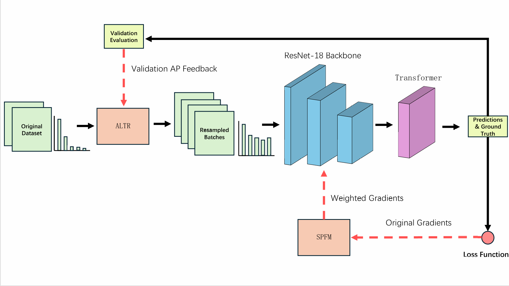

# Robust Joint Training for Long-Tailed Defect Detection with Lightweight RT-DETR

Official implementation of *"Robust Joint Training for Long-Tailed Defect
Detection with Lightweight RT-DETR"* (submitted to Pattern Analysis and
Applications).

<p align="center">
  
</p>

## Highlights

- **ALTR** (Adaptive Long-Tail Resampling): dynamically adjusts class-wise
  sampling rates using validation AP feedback (Section 3.4).
- **SPFM** (Self-Paced Focused Matching): bilateral gradient modulation
  based on positive-sample matching quality with robust center estimation
  via median + EMA + interval clamping (Section 3.5).
- Both modules are **training-side only** — zero additional inference overhead.
- Built upon [DEIM](https://github.com/ShihuaHuang95/DEIM) and
  [RT-DETR](https://github.com/lyuwenyu/RT-DETR).

## Requirements

- Python >= 3.8
- PyTorch >= 1.12
- CUDA >= 11.3

```bash
# 1. Clone this repo
git clone https://github.com/YourUsername/RT-DETR-LongTail.git
cd RT-DETR-LongTail

# 2. Install DEIM framework (base codebase)
git clone https://github.com/ShihuaHuang95/DEIM.git
cd DEIM && pip install -e . && cd ..

# 3. Install additional dependencies
pip install -r requirements.txt
```

## Integration with DEIM

This repository provides the **new and modified files** on top of the DEIM
framework. To integrate:

```bash
# Copy ALTR sampler and dataset info into DEIM engine
cp engine/altr_sampler.py    DEIM/engine/
cp engine/dataset_info.py    DEIM/engine/

# Replace the solver and criterion with SPFM-enhanced versions
cp engine/solver/det_solver.py  DEIM/engine/solver/
cp src/core/deim_criterion.py   DEIM/src/core/

# Copy config files
cp configs/*.yml  DEIM/configs/rtdetr/
```

> **Note:** You will need to update `engine/dataset_info.py` with your own
> dataset statistics before training. See the file for details.

## Dataset Preparation

### In-house Industrial Defect Dataset

Due to proprietary restrictions, the in-house power line defect dataset
cannot be publicly released. The dataset contains **5,459 instances**
across **7 categories** with a clear long-tailed distribution:

| Group  | Category               | Training Instances |
|--------|------------------------|--------------------|
| Head   | insulator              | 3,679              |
| Head   | damper                 | 523                |
| Medium | insulator\_flashover   | 489                |
| Medium | insulator\_breakage    | 279                |
| Medium | damper\_defect         | 208                |
| Medium | insulator\_stringdrop  | 204                |
| Tail   | nest                   | 77                 |

Please refer to Section 4.1.1 of the paper for full dataset statistics.

### DeepPCB Long-Tail Setting

1. Download the original DeepPCB dataset from
   [tangsanli5201/DeepPCB](https://github.com/tangsanli5201/DeepPCB).

2. Construct the long-tailed training set (imbalance factor = 10):

```bash
python tools/construct_deeppcb_longtail.py \
    --data_root /path/to/DeepPCB \
    --output_dir /path/to/DeepPCB_LongTail \
    --imbalance_factor 10 \
    --seed 42
```

The constructed split follows Table A2 in the paper:

| Class     | Original | Long-tail | Retention |
|-----------|----------|-----------|-----------|
| short     | 1,373    | 1,373     | 100.0%    |
| mousebite | 1,360    | 866       | 63.1%     |
| pin-hole  | 1,077    | 546       | 39.8%     |
| copper    | 1,045    | 344       | 25.1%     |
| spur      | 983      | 217       | 15.8%     |
| open      | 981      | 137       | 10.0%     |

## Evaluation

```bash
python tools/eval.py \
    --config configs/rtdetr_r18_altr_rspfm.yml \
    --weights /path/to/checkpoint.pth
```

## Main Results

### In-house Industrial Defect Dataset

| Configuration               | mAP@0.5:0.95 | mAP@0.5   | AP\_H     | AP\_M     | AP\_T |
|-----------------------------|---------------|-----------|-----------|-----------|-------|
| Baseline (RT-DETR-R18)      | 66.74         | 92.08     | 72.42     | 66.89     | 54.47 |
| + ALTR                      | 67.73         | 91.87     | 72.75     | 68.80     | 54.30 |
| + SPFM                      | 67.17         | 92.75     | 73.16     | 67.15     | 55.26 |
| + ALTR + SPFM (naive)       | 67.90         | 92.26     | 72.50     | 68.83     | 54.80 |
| **+ ALTR + Robust SPFM**    | **68.56**     | **92.62** | **72.94** | **69.80** | 54.84 |

### DeepPCB Long-Tail Setting (mean ± std, 3 seeds)

| Configuration               | mAP@0.5:0.95     | AP\_H            | AP\_M            |
|-----------------------------|-------------------|------------------|------------------|
| Baseline                    | 73.97 ± 0.28     | 73.13 ± 0.22     | 74.80 ± 0.41     |
| ALTR + SPFM (naive)         | 76.12 ± 0.47     | 74.88 ± 0.29     | 77.05 ± 0.63     |
| **ALTR + Robust SPFM**      | **77.38 ± 0.19** | **75.02 ± 0.16** | **79.82 ± 0.27** |

### Backbone Generalization (ResNet-50)

| Configuration                  | mAP@0.5:0.95 | AP\_H  | AP\_M     | AP\_T     |
|--------------------------------|---------------|--------|-----------|-----------|
| Baseline (RT-DETR-R50)         | 70.08         | 74.11  | 79.44     | 61.16     |
| **Ours (ALTR + Robust SPFM)** | **71.17**     | 74.01  | **81.15** | **62.63** |

## Hyperparameters

| Module | Parameter | Default | Description |
|--------|-----------|---------|-------------|
| ALTR | `RFS_T` | dataset-dep | RFS frequency threshold |
| ALTR | Target AP anchor A₀ | 0.65 | Classes below receive stronger resampling |
| ALTR | Density scaling bounds | [0.5, 1.2] | Clipping range for feedback factor |
| SPFM | EMA momentum m | 0.99 | Smoothing for inter-batch fluctuations |
| SPFM | Focus center range | [0.35, 0.65] | Interval clamping of μ_focus |
| SPFM | Gaussian bandwidth σ | 0.22 | Controls bilateral attenuation width |
| SPFM | IoU threshold | 0.15 | Hard mask for low-quality matches |
| SPFM | `UPDATE_INTERVAL` | 5 | Teacher evaluation frequency (epochs) |
| SPFM | `TAU_START` / `TAU_END` | 0.1 / 1.0 | Priority temperature schedule |
| SPFM | `LAMBDA_SMOOTH` | 0.1 | Priority weight smoothing factor |

## Citation

```bibtex
@article{gu2025robust,
  title   = {Robust Joint Training for Long-Tailed Defect Detection
             with Lightweight {RT-DETR}},
  author  = {Gu, Jiahao and {Supervisor LastName}, {Supervisor FirstName}},
  journal = {Pattern Analysis and Applications},
  year    = {2025},
  note    = {Submitted}
}
```

## Acknowledgements

This codebase is built upon
[DEIM](https://github.com/ShihuaHuang95/DEIM) and
[RT-DETR](https://github.com/lyuwenyu/RT-DETR).
We thank the authors for their excellent open-source contributions.

## License

This project is released under the [Apache 2.0 License](LICENSE).
